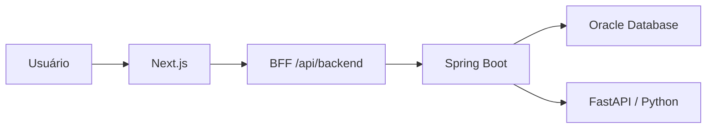

# GovAtende — API Java

API REST responsável pelas regras de negócio, autenticação, persistência, auditoria, relatórios e integração com Inteligência Artificial do GovAtende.

O GovAtende é uma plataforma GovTech que permite ao cidadão registrar e acompanhar solicitações de serviços públicos, enquanto servidores realizam a triagem e o atendimento das demandas. Auditores possuem acesso exclusivo às trilhas de governança do sistema.

## Funcionalidades

### Cidadão

- Cadastro e autenticação;
- Consulta e atualização do próprio perfil;
- Desativação da própria conta;
- Registro de solicitações;
- Consulta das próprias solicitações;
- Acompanhamento do histórico de status;
- Cancelamento de solicitações permitidas;
- Envio e acesso aos próprios anexos;
- Recebimento de notificações.

### Servidor

- Autenticação de servidor;
- Consulta das solicitações registradas;
- Fila de triagem ordenada por urgência;
- Consulta de dados necessários ao atendimento;
- Alteração controlada do status;
- Consulta e download de anexos;
- Geração de análises com Inteligência Artificial;
- Consulta de relatórios estatísticos;
- Geração de previsões de demanda;
- Consulta do histórico de previsões.

### Auditor

- Autenticação pelo acesso interno;
- Consulta exclusiva das trilhas de auditoria;
- Aplicação de filtros e paginação;
- Consulta de relatórios estatísticos;
- Exportação de relatórios;
- Acompanhamento de acessos negados e operações sensíveis.

## Arquitetura



O navegador não acessa diretamente o token JWT. O front-end armazena a autenticação em cookies `HttpOnly` e encaminha as requisições ao Java por meio do BFF do Next.js.

A API Java permanece stateless e valida o JWT recebido no cabeçalho `Authorization`.

## Tecnologias

- Java 21;
- Spring Boot 4.1;
- Spring Web;
- Spring Data JPA;
- Spring Security;
- Bean Validation;
- JWT;
- Oracle Database;
- Maven Wrapper;
- Integração HTTP com FastAPI;
- JUnit e Spring Boot Test.

## Repositórios

| Camada | Repositório |
|---|---|
| Front-end Next.js | [govAtende](https://github.com/Lsko27/govAtende) |
| Back-end Java | [enterprise-challenge3](https://github.com/Lsko27/enterprise-challenge3) |
| Microsserviço Python | [enterprise-challenge3-python](https://github.com/Lsko27/enterprise-challenge3-python) |

## Pré-requisitos

Antes de iniciar a API, instale:

- Java 21;
- Oracle Database ou acesso a uma instância Oracle;
- Git;
- Microsserviço Python do GovAtende;
- Front-end Next.js, caso queira executar a solução completa.

O Maven não precisa ser instalado globalmente porque o projeto possui Maven Wrapper.

## Configuração local

O arquivo com credenciais não deve ser versionado.

Copie o modelo:

```powershell
Copy-Item `
  src/main/resources/application-local.example.properties `
  src/main/resources/application-local.properties
```

Depois, preencha o arquivo:

```text
src/main/resources/application-local.properties
```

Exemplo:

```properties
spring.datasource.url=jdbc:oracle:thin:@//SEU_HOST:1521/SEU_SERVICE_NAME
spring.datasource.username=SEU_USUARIO
spring.datasource.password=SUA_SENHA
spring.datasource.driver-class-name=oracle.jdbc.OracleDriver

spring.jpa.database-platform=org.hibernate.dialect.OracleDialect

jwt.secret=SUA_CHAVE_BASE64_SEGURA
jwt.expiration-ms=3600000

app.cors.allowed-origin=http://localhost:3000
app.upload.dir=uploads
app.setup.auditor-key=SUA_CHAVE_LOCAL_FORTE

govatende.ia.base-url=http://127.0.0.1:8000
govatende.ia.url=http://127.0.0.1:8000
```

Para gerar uma chave JWT em Base64 pelo PowerShell:

```powershell
[Convert]::ToBase64String(
  [Text.Encoding]::UTF8.GetBytes(
    "substitua-por-uma-chave-longa-com-32-bytes-ou-mais"
  )
)
```

Nunca publique senhas, chaves JWT ou credenciais do Oracle.

## Execução

Primeiro, inicie o microsserviço Python na porta `8000`.

Depois, execute a API Java:

```powershell
.\mvnw.cmd spring-boot:run
```

No Linux ou macOS:

```bash
./mvnw spring-boot:run
```

A API ficará disponível em:

```text
http://localhost:8080
```

Verifique o funcionamento:

```text
GET http://localhost:8080/api/status
```

## Ordem recomendada de execução

1. Oracle Database;
2. Microsserviço Python na porta `8000`;
3. API Java na porta `8080`;
4. Front-end Next.js na porta `3000`.

## Principais endpoints

### Autenticação e perfil

| Método | Endpoint | Perfil |
|---|---|---|
| POST | `/api/auth/login` | Público |
| POST | `/api/auth/servidor/login` | Público |
| POST | `/api/cidadaos` | Público |
| GET | `/api/cidadaos/me` | Cidadão |
| PUT | `/api/cidadaos/me` | Cidadão |
| PATCH | `/api/cidadaos/me/desativar` | Cidadão |
| GET | `/api/servidor/me` | Servidor ou auditor |

O perfil `AUDITOR` utiliza o mesmo endpoint interno de login dos servidores. O perfil retornado pelo JWT define as permissões concedidas.

### Catálogo de serviços

| Método | Endpoint | Acesso |
|---|---|---|
| GET | `/api/categorias` | Público |
| GET | `/api/categorias/{id}` | Público |
| GET | `/api/categorias/{categoriaId}/subservicos` | Público |
| GET | `/api/subservicos/{id}` | Público |

### Solicitações do cidadão

| Método | Endpoint |
|---|---|
| POST | `/api/solicitacoes` |
| GET | `/api/solicitacoes/minhas` |
| GET | `/api/solicitacoes/{id}` |
| GET | `/api/solicitacoes/{id}/historico` |
| PATCH | `/api/solicitacoes/{id}/cancelar` |

### Atendimento do servidor

| Método | Endpoint |
|---|---|
| GET | `/api/servidor/solicitacoes` |
| GET | `/api/servidor/solicitacoes/fila-triagem` |
| GET | `/api/servidor/solicitacoes/{id}` |
| GET | `/api/servidor/solicitacoes/{id}/historico` |
| PATCH | `/api/servidor/solicitacoes/{id}/status` |

### Inteligência Artificial

| Método | Endpoint | Finalidade |
|---|---|---|
| POST | `/api/servidor/solicitacoes/{id}/analise-ia` | Gerar análise da solicitação |
| GET | `/api/servidor/solicitacoes/{id}/analise-ia` | Consultar análise mais recente |
| GET | `/api/servidor/solicitacoes/{id}/analise-ia/historico` | Consultar histórico |
| POST | `/api/servidor/previsoes-demanda/gerar` | Gerar previsões |
| GET | `/api/servidor/previsoes-demanda/ultima` | Consultar última geração |
| GET | `/api/servidor/previsoes-demanda/historico` | Consultar histórico |
| GET | `/api/servidor/previsoes-demanda/resumo` | Consultar resumo |

### Relatórios e auditoria

| Método | Endpoint | Perfil |
|---|---|---|
| GET | `/api/servidor/relatorios/estatisticas` | Servidor ou auditor |
| GET | `/api/servidor/relatorios/estatisticas/exportar` | Servidor ou auditor |
| GET | `/api/servidor/auditoria` | Auditor |

## Perfis e controle de acesso

| Perfil | Permissões principais |
|---|---|
| `CIDADAO` | Gerencia o próprio perfil e as próprias solicitações |
| `SERVIDOR` | Realiza triagem, atendimento e consulta operacional |
| `AUDITOR` | Consulta auditoria, relatórios e exportações autorizadas |
| `SISTEMA` | Identifica eventos automáticos ou acessos sem ator autenticado |

O controle é aplicado pelo Spring Security com autorização baseada em papéis.

Rotas não declaradas são bloqueadas por padrão.

## Criação local do primeiro auditor

O endpoint de configuração existe somente quando o perfil Spring `local` está ativo:

```text
POST /api/setup/auditor
```

A requisição deve conter o cabeçalho:

```text
X-Setup-Key: valor-configurado-em-app.setup.auditor-key
```

Exemplo de corpo:

```json
{
  "nome": "Responsável pela Governança",
  "matricula": "AUD0001",
  "email": "auditor@govatende.local",
  "cargo": "Auditor de Governança",
  "senha": "Auditor@2026"
}
```

Exemplo com `curl.exe`:

```powershell
curl.exe -X POST `
  "http://localhost:8080/api/setup/auditor" `
  -H "Content-Type: application/json" `
  -H "X-Setup-Key: SUA_CHAVE_LOCAL_FORTE" `
  -d '{
    "nome": "Responsável pela Governança",
    "matricula": "AUD0001",
    "email": "auditor@govatende.local",
    "cargo": "Auditor de Governança",
    "senha": "Auditor@2026"
  }'
```

Esse endpoint não deve ser disponibilizado em produção. O serviço também impede a criação de mais de um auditor ativo por esse fluxo inicial.

## Auditoria

O sistema registra operações relevantes, incluindo:

- Login com sucesso ou negado;
- Acesso sem autenticação;
- Acesso realizado por perfil sem permissão;
- Consulta de dados pessoais;
- Alteração de status;
- Cancelamento de solicitação;
- Download de anexo;
- Consulta e exportação de relatório;
- Consulta das próprias trilhas de auditoria.

Os registros incluem ator, ação, recurso, resultado, endpoint, método HTTP, endereço IP e data do evento.

Logs técnicos auxiliam na manutenção da aplicação. Registros de auditoria possuem finalidade de governança, responsabilização e rastreabilidade.

## Estruturas de dados e algoritmos

A API utiliza diferentes estruturas de dados conforme o problema tratado.

### Fila de prioridade

A fila de triagem utiliza `PriorityQueue`, implementada internamente como heap binário.

A ordenação considera:

1. Maior urgência;
2. Solicitação mais antiga;
3. Identificador como critério de desempate.

A inserção e a remoção possuem complexidade aproximada de `O(log n)`.

### Pilha

O histórico reverso utiliza `ArrayDeque` como pilha, permitindo percorrer alterações da mais recente para a mais antiga.

As operações de inserção e remoção nas extremidades possuem custo amortizado `O(1)`.

### Mapas

Relatórios e previsões utilizam `HashMap` para agrupamentos e acesso por chave.

A busca e a inserção possuem custo médio `O(1)`.

### Ordenação

A previsão de demanda utiliza ordenação para apresentar os bairros com maior demanda prevista.

A complexidade típica da ordenação é `O(n log n)`.

A documentação detalhada encontra-se nos diretórios `docs` dos projetos.

## SQL avançado

O projeto contém uma consulta analítica com:

- Common Table Expressions;
- Agrupamentos;
- Totais;
- Média;
- Funções condicionais;
- `DENSE_RANK`;
- Funções de janela com `SUM() OVER`;
- Participação percentual por bairro e categoria.

Arquivo:

```text
docs/sql/analise-demanda-bairros.sql
```

A consulta ajuda a identificar concentração territorial de demandas e apoia a alocação de equipes públicas.

## Segurança

Entre as medidas adotadas estão:

- JWT com expiração;
- API stateless;
- Senhas armazenadas com hash;
- Autorização baseada em perfis;
- Bloqueio padrão de rotas desconhecidas;
- Validação de entrada;
- CPF mascarado nas respostas;
- Consultas vinculadas ao usuário autenticado;
- CORS restrito ao front-end configurado;
- Limite para upload de arquivos;
- Auditoria de operações sensíveis;
- Segredos mantidos fora do Git;
- Tokens protegidos em cookies `HttpOnly` no front-end.

## Arquivos e anexos

Por padrão, os arquivos são armazenados em:

```text
uploads/
```

Esse diretório não é versionado.

O limite configurado é:

- 5 MB por arquivo;
- 6 MB por requisição multipart.

## Testes

Execute:

```powershell
.\mvnw.cmd clean test
```

Para compilar o projeto sem executar o servidor:

```powershell
.\mvnw.cmd clean package
```

## Documentação acadêmica

O projeto atende à fase da FIAP envolvendo:

- Integração entre front-end, back-end e banco de dados;
- Inteligência Artificial;
- Persistência das previsões;
- SQL avançado;
- Estruturas de dados;
- Busca e ordenação;
- Análise de complexidade com Notação Big O;
- Segurança, governança e auditoria.

## Autores

- Yuri Lesko — RM 564119
- Caio Oliveira — RM 561294
- Rebeka Luna Lima — RM 565859
- Sérgio Cavalcante — RM 563208
- Rubens Escobar — RM 562164

Projeto acadêmico desenvolvido para a FIAP.